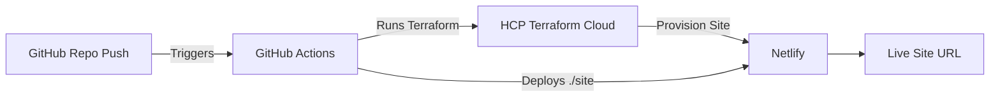

Got it 👍. Here’s the full **README** with a **Quickstart Example** included, so someone can fork and deploy without running Terraform locally:

---

# 🚀 Terraform + Netlify Site Deployment

This project provisions and deploys a **Netlify site** using **Terraform** and automates deployment with **GitHub Actions**.
It demonstrates Infrastructure as Code (IaC) principles while ensuring the setup is **re-runnable** with fresh credentials.

---

## 📋 Requirements

Before you begin, ensure you have:

- A [Netlify account](https://www.netlify.com/)
- A [Terraform Cloud (HCP Terraform) account](https://app.terraform.io/)
- A GitHub repository with Actions enabled

Optional (for local testing only):

- [Terraform CLI](https://developer.hashicorp.com/terraform/downloads)
- [Netlify CLI](https://docs.netlify.com/cli/get-started/)

---

## 🏗 How It Works

1. Terraform uses the **Netlify provider** to create a new Netlify site with a unique subdomain.
2. HCP Terraform manages state and runs your Terraform commands.
3. GitHub Actions automatically deploys your static site contents (`./site`) to Netlify on every push.
4. Outputs include the live site URL, site ID, and site subdomain.

⚠️ **Note:** Running Terraform _locally_ will only **create the site** in Netlify, not deploy your files.
The **full workflow (site creation + deployment)** happens through GitHub Actions.

---

## 🔑 Required Secrets

### 1. GitHub Repository (for CI/CD deployment)

Go to: **Settings → Secrets and variables → Actions → New repository secret**

- `NETLIFY_AUTH_TOKEN` → your Netlify Personal Access Token
- `TF_API_TOKEN` → your HCP Terraform API Token

### 2. HCP Terraform (for provisioning)

Go to: **Workspace → Variables → Add variable**

- **Variable name:** `netlify_token`
- **Category:** Environment variable
- **Value:** your Netlify Personal Access Token
- **Sensitive:** Checked

---

## ⚙️ Usage

### Local (for testing only)

```sh
terraform init
terraform plan
terraform apply
```

This creates a Netlify site but does not deploy files.

### CI/CD (GitHub Actions)

- Push changes to your repo.
- GitHub Actions runs `terraform init/plan/apply` automatically with the correct credentials.
- The site is deployed to Netlify and the URL is available in the Terraform outputs.

---

## 📦 Outputs

After a successful run, Terraform provides on the HCP console:

- **live_site_url** → URL of the deployed Netlify site
- **netlify_site_id** → ID of the Netlify site
- **netlify_site_name** → Subdomain name of the Netlify site

---

## ✅ Re-runnability

This setup is **re-runnable**:

- Every `terraform init/plan/apply` run works with fresh credentials.
- A new Netlify subdomain is generated automatically (using the random suffix).
- GitHub Actions ensures deployments remain automated.

---

## 🚀 Quickstart Example

Want to try it fast? Follow these steps:

1. **Fork this repository** into your own GitHub account.
2. **Set GitHub Actions Secrets** in your repo:

   - `NETLIFY_AUTH_TOKEN` → from your Netlify account
   - `TF_API_TOKEN` → from your HCP Terraform account

3. **Set HCP Terraform Variable** in your workspace:

   - `netlify_token` → same Netlify Personal Access Token

4. **Push a commit** (even a small change like editing `README.md`).
5. GitHub Actions will run, create your Netlify site, and deploy `./site`.

✅ Once complete, the **live site URL** will be available in the Terraform outputs in HCP.

---

## 🔗 Workflow Diagram



---
